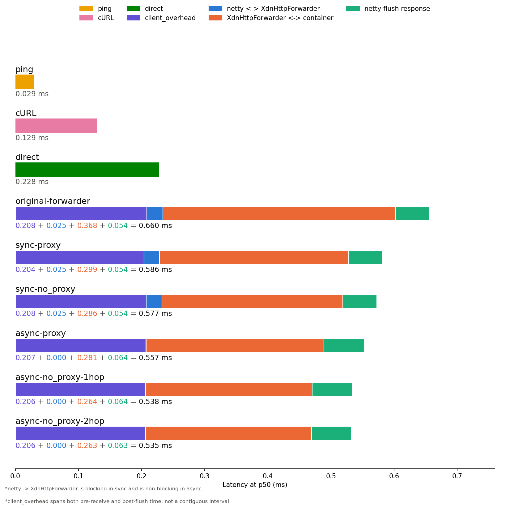
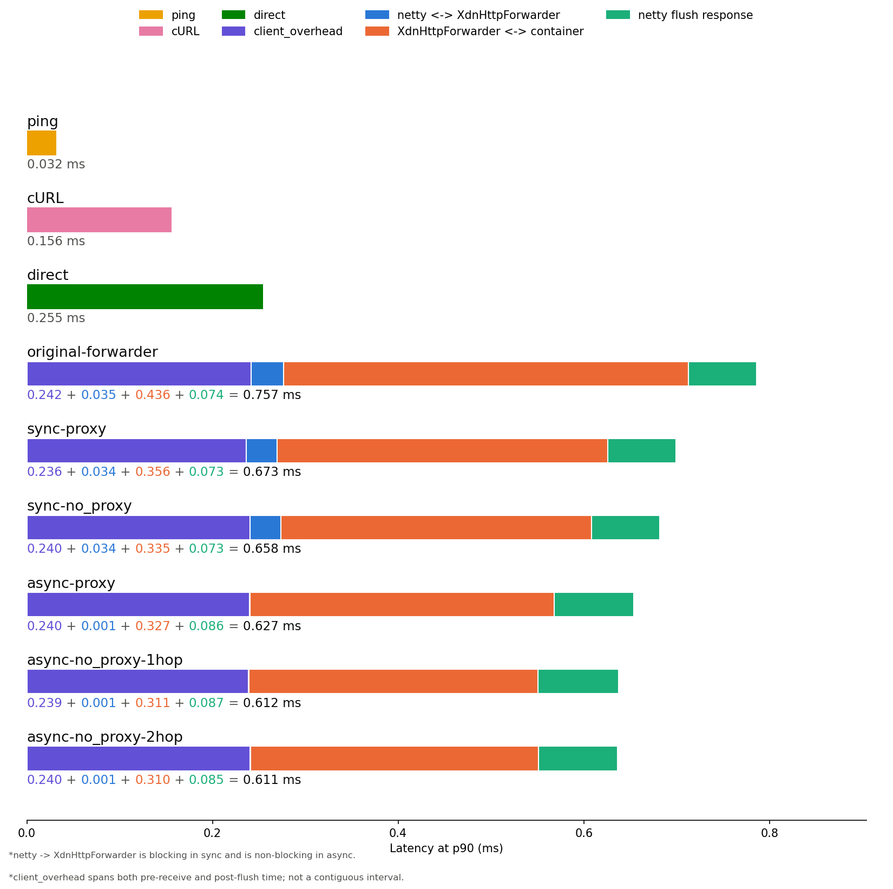

# XDN HTTP forwarder latency benchmarking toolkit

This toolkit measures where time goes when a request travels from a client to a container, either directly or through the XDN HTTP forwarder. It breaks latency down into ICMP, TCP, and HTTP layers, and for requests that go through the forwarder, it further breaks down the time spent in each stage of `XdnHttpForwarderClient`.

The goal is to answer a specific question: when the forwarder adds latency compared to a direct request, where does that time actually get spent. The scripts here let you measure a baseline (ping, curl, direct-to-container) and compare it against any combination of the forwarder's blocking, proxy, and thread pool settings.

This guide walks through everything needed to reproduce the results from scratch on two machines.

## Prerequisites

You need two machines on the same network. Run this on both of them.

```sh
# Get k6, ant, python
curl -fsSL https://dl.k6.io/key.gpg | sudo gpg --dearmor -o /usr/share/keyrings/k6-archive-keyring.gpg
echo "deb [signed-by=/usr/share/keyrings/k6-archive-keyring.gpg] https://dl.k6.io/deb stable main" | sudo tee /etc/apt/sources.list.d/k6.list
sudo apt-get update
sudo apt install -y k6 ant openjdk-21-jdk maven python3 python3-pip python3-numpy

# Get Docker
## Add Docker's official GPG key
sudo install -m 0755 -d /etc/apt/keyrings
sudo curl -fsSL https://download.docker.com/linux/ubuntu/gpg -o /etc/apt/keyrings/docker.asc
sudo chmod a+r /etc/apt/keyrings/docker.asc

## Add the repository to Apt sources
sudo tee /etc/apt/sources.list.d/docker.sources <<EOF
Types: deb
URIs: https://download.docker.com/linux/ubuntu
Suites: $(. /etc/os-release && echo "${UBUNTU_CODENAME:-$VERSION_CODENAME}")
Components: stable
Signed-By: /etc/apt/keyrings/docker.asc
EOF

## Install Docker
sudo apt update
sudo apt install -y docker-ce docker-ce-cli containerd.io docker-buildx-plugin docker-compose-plugin

## Allow non-root to use Docker
sudo usermod -aG docker $USER
newgrp docker
docker ps -a
```

You also need `matplotlib` for the graph script.

```sh
pip install matplotlib --break-system-packages
```

This toolkit was built and tested against k6 v2.0.0. The `--out json` format has changed across k6 versions before, so if you're on a different version and something doesn't parse, check your k6's JSON output structure against what `analyze-k6.py` expects before assuming the script is broken.

```sh
k6 --version
# k6 v2.0.0 (commit/devel, go1.26.5, linux/amd64)
```

## Topology

You need two machines, referred to below as the replica machine and the client machine. These tests were run on CloudLab, with both machines on the same cluster and private network, but any two machines on a shared LAN work the same way.

The replica machine always runs the docker container and, for the forwarder tiers, the `ForwarderFrontend` Java process. The client machine always runs `benchmark.sh`, `k6`, and the analysis and graphing scripts.

Throughout this guide, `<replica-ip>` and `<client-ip>` stand in for whatever addresses your two machines actually have. On CloudLab these usually look like `10.10.1.1` and `10.10.1.2`.

## Setup

Clone the repository and move into the toolkit directory.

```sh
git clone <url-to-this-repository>
cd xdn/eval/xdn-http-forwarder
```

The next two commands only need to run on the replica machine. The commands assume you're running them from inside `xdn/eval/xdn-http-forwarder`.

```sh
# Build XDN
../../bin/build_xdn_jar.sh

# Build ForwarderFrontend
javac -cp ../../build/classes:../../lib/netty-all-4.1.50.Final.jar -d out src/ForwarderFrontend.java
```

The docker container that stands in for the backend service is defined in `docker-compose.yml`, already included in this directory.

```yaml
name: xdn-forwarder-bench

services:
  bookcatalog-app:
    image: michael2718/mock-bookcatalog:1
    ports:
      - "8000:80"
```

Start it on the replica machine before running any of the measurements below.

```sh
docker compose up -d
```

## Running the measurements

There are four kinds of measurements. Run them in whatever order you like, but the container needs to be up on the replica machine for all of them except the raw ICMP ping.

### ICMP and HTTP baseline

This measures the raw network path with no k6 or forwarder involved. Run it on the client machine, pointed at the replica machine's IP.

```sh
./benchmark.sh --ip <replica-ip> --port 8000 --path /api/books --count 20000 --interval 0.01
```

This produces `ping_raw.txt` and `http_raw.txt` in the current directory. The ping stage needs root for intervals under 200ms, so you'll be prompted for your password when it runs.

### Direct to container

This uses k6 to send an open loop workload straight to the container, bypassing the forwarder entirely. It gives you a baseline for what the container itself can do under load.

```sh
TIER=direct ADDR=<replica-ip>:8000 k6 run --out json=results/k6-direct.json k6/write.js
```

### Through the forwarder

This is the interesting case. `ForwarderFrontend` sits between k6 and the container, and you can configure how it forwards requests using three flags.

On the replica machine, start the forwarder with whichever combination of flags you want to test.

```sh
java -cp out:../../build/classes:../../lib/netty-all-4.1.50.Final.jar ForwarderFrontend \
    --p-listen 3000 \
    --containerName xdn-forwarder-bench-bookcatalog-app-1 \
    --p-docker 8000 \
    --proxy-mode true \
    --blocking true \
    --shared-group false \
    --log results/sync-proxy-2hop.log
```

`--containerName` should match whatever docker actually named your container, which you can check with `docker ps`. Compose usually names it `<project>-<service>-<replica number>`, so with the compose file above it will be something like `xdn-forwarder-bench-bookcatalog-app-1`, but don't assume this, check it yourself.

It's worth setting `--log` explicitly every time. The default is `forwarder-timings.log`, which tells you nothing about which configuration produced it once you have more than one run sitting in the same directory.

Here's what each flag controls and what the resulting log file is usually named for the graph:

| --blocking | --proxy-mode | --shared-group | Meaning | Typical name |
|---|---|---|---|---|
| true | true | false | Blocking wait for the container response, requests go through docker-proxy, forwarder has its own thread pool | sync-proxy-2hop |
| true | true | true | Blocking wait, through docker-proxy, netty's worker group doubles as the forwarder's thread pool | sync-proxy-1hop |
| true | false | false | Blocking wait, requests sent directly to the container's private address, separate thread pool | sync-noproxy-2hop |
| true | false | true | Blocking wait, direct to container, netty's worker group doubles as the forwarder's thread pool | sync-noproxy-1hop |
| false | true | false | Non-blocking callback instead of a blocking wait, through docker-proxy, separate thread pool | async-proxy-2hop |
| false | true | true | Non-blocking callback, through docker-proxy, shared thread pool | async-proxy-1hop |
| false | false | false | Non-blocking callback, direct to container, separate thread pool | async-noproxy-2hop |
| false | false | true | Non-blocking callback, direct to container, shared thread pool | async-noproxy-1hop |

There's a ninth configuration worth knowing about: the original, unoptimized version of `XdnHttpForwarderClient`, before any of this work started. It used a blocking wait, went through docker-proxy, and had a separate thread pool, which is the same behavior as the sync-proxy-2hop row above, but it's not the same code. If you need to reproduce that exact baseline rather than the current code running with those flag values, check the git history for the version that predates these flags.

`--containerName`, `--p-listen`, and `--p-docker` default to `bookcatalog`, `3000`, and `8000` if you don't set them, but it's safer to be explicit.

Once the forwarder is running, send the workload from the client machine. The `TIER` environment variable just gets tagged onto the k6 metrics, so name it however makes sense to you.

```sh
TIER=sync-proxy-2hop ADDR=<replica-ip>:3000 k6 run --out json=results/k6-sync-proxy-2hop.json k6/write.js
```

Repeat this for whichever flag combinations you want to compare, changing `--log`, the `TIER` value, and the k6 output filename each time.

You'll also notice a second log file appear next to the one you specified, with `-inner` added before the extension, for example `sync-proxy-2hop-inner.log`. This is written automatically by `InnerTimingLogger` and gives a more detailed breakdown of what happens inside the non-blocking, async code path specifically. You don't need it for the standard workflow in this guide. `analyze-k6.py` and `visualize-latency.py` only read the main log file.

### Copying results to the client machine

The graph gets drawn on the client machine, so if your Java logs were written on the replica machine, copy them over first. An SSH key is optional here, it depends on how your machines are set up.

```sh
rsync -avzP -e "ssh -i <your-key>.pem" <user>@<replica-ip>:~/xdn/eval/xdn-http-forwarder/results/ ./results/
```

## Generating the graph

`visualize-latency.py` takes a series of `--label` groups, one per bar you want on the chart, and produces three PNG files in a single run: `latency_waterfall_p50.png`, `latency_waterfall_p90.png`, and `latency_waterfall_p95.png`. You don't need to run it three times, one call handles all three percentiles.

```sh
python3 visualize-latency.py \
    --label ping --type ping --log ping_raw.txt \
    --label cURL --type http --log http_raw.txt \
    --label direct --type tier0 --k6 results/k6-direct.json \
    --label sync-proxy-2hop --type tier1 --k6 results/k6-sync-proxy-2hop.json --log results/sync-proxy-2hop.log \
    --label async-noproxy-1hop --type tier1 --k6 results/k6-async-noproxy-1hop.json --log results/async-noproxy-1hop.log
```

Bars appear top to bottom in the order you pass `--label`, and the text you give each label is used verbatim, both in the chart and in the legend.

## How the numbers are calculated

Each bar's value comes from a different place depending on its type.

For `ping` and `http`, the raw per-request time is pulled straight from `ping`'s and `curl`'s own output, with the very first sample of each run excluded, since it can be inflated by ARP resolution or an initial TCP handshake that every later sample skips.

For `tier0`, k6's own per-request latency values are used directly, no correlation with anything else needed since there's no forwarder in the path.

For `tier1`, the process has a few more steps. Every request k6 sends gets a `reqId`, generated in `write.js` and passed through as the `X-XDN-ReqId` header. The forwarder writes its own log line per request, also tagged with that same `reqId`, recording four timestamps as the request moves through netty and the forwarder. The two files get joined by matching `reqId`. Any request that shows up in one file but not the other gets dropped, and so does any request where the forwarder didn't return a 200 status.

For each request that survives that join, four numbers get computed: the time between netty receiving the request and dispatching it to the forwarder client, the time the forwarder spends waiting on the container, the time netty takes to flush the response back to the client, and a fourth value called client overhead, which is just k6's reported latency minus the sum of the other three. That last one captures whatever happens outside the Java process entirely, the network hops on either end that the Java log never sees.

Once every request has these four numbers, each one gets its own percentile calculated separately. The dispatch time's p50 comes from sorting all the dispatch times and taking the middle one. The container wait time's p50 comes from sorting all the container wait times, independently. Nothing here averages requests together across categories, and nothing splits an already computed total into pieces.

This matters because the four percentiles will not add up exactly to k6's own reported latency percentile for that same run. That's expected. The request that happens to sit at the median for container wait time is not necessarily the same request that sits at the median for netty flush time, so their percentiles come from different individual requests and don't need to sum to anything in particular. The equation printed under each bar in the graph shows this directly: the four colored numbers on the left are each stage's own independent percentile, and the number after the equals sign is k6's actual measured percentile for that run, not the sum of what's on the left. If you add up the four numbers yourself and it doesn't quite match, that gap is real information, not a mistake in the script.

## Things to know before trusting the results

A few things came up while building this that are worth knowing before you interpret the numbers.

The client overhead segment, drawn as the leftmost part of each tier1 bar, is not one continuous stretch of time. It's the sum of two separate gaps, the time before netty received the request and the time after netty finished sending the response, added together because that's all the data lets you compute. The bar draws it as one block for the sake of having somewhere to put it, but there's no way to tell from this data how much of it happened before the request arrived versus after the response left.

`ping` needs root when the interval is under 200 milliseconds, which is the default `benchmark.sh` uses. You'll get a sudo prompt the first time. If you run the script again within a few minutes, sudo may not prompt you a second time because your credentials are still cached from the last run, not because the command silently ran without permission.

The timestamps in the Java log come from `System.nanoTime()`, not wall clock time. That means they're only meaningful as differences within the same log file, on the same running process. You can subtract two timestamps from the same log to get a duration, but you can never compare a timestamp from this log against a timestamp from k6 or from a different machine, since `nanoTime()` has no defined relationship to actual clock time at all. This is also why correlation between k6 and the Java log happens entirely through the `reqId` string, never through timestamps.

## Sample output

These were produced on two UMass CloudLab rs630 machines on the same cluster, with the docker container running plain nginx configured to respond immediately, so its own processing time is effectively zero.






A quick glossary for the bar names in these images:

`ping` is a closed loop ICMP ping between the two machines, 20000 requests. `cURL` is a closed loop GET request straight to the container, also 20000 requests. `direct` is k6 sending an open loop workload at 500 requests per second straight to the container, no forwarder involved.

The rest of the bars all go through `XdnHttpForwarderClient`, and their names describe which combination of settings was used.

`original-forwarder` is the unoptimized version of the forwarder that existed before any of this work started. `sync` means the forwarder blocks the calling thread while it waits for the container's response. `async` means it uses a callback instead and doesn't block. `proxy` means requests go through docker's own proxy layer. `no_proxy` means requests bypass that and go straight to the container's private address using iptables DNAT. `2hop` means the request passes through netty's boss group, then its worker group, then a separate thread pool for the forwarder client. `1hop` means that last handoff is removed, and netty's worker group is used directly as the forwarder client's thread pool.

## Toolkit reference

| Script | What it does |
|---|---|
| `benchmark.sh` | Runs the ICMP ping and keep alive curl measurements against a target ip and port, writing raw per request samples to `ping_raw.txt` and `http_raw.txt`. |
| `analyze.py` | Reads `benchmark.sh`'s raw output and prints p50, p90, and p95 for ping and http, with and without the first sample. |
| `analyze-k6.py` | Analyzes a single k6 run, either alone for tier0, or joined against a Java forwarder log for tier1, printing latency percentiles and the sub-stage breakdown for one run at a time. |
| `visualize-latency.py` | Takes any combination of ping, http, tier0, and tier1 results and draws them as horizontal stacked bars, producing one PNG each for p50, p90, and p95. |
