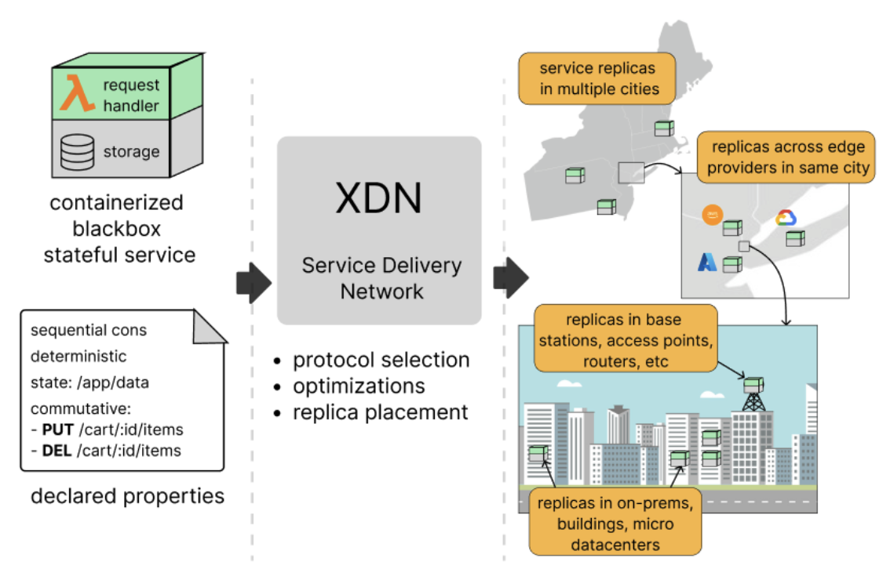

# The architecture of XDN

XDN is split into two planes: a **control plane** that decides *where* a service
runs and resolves clients to it, and a **replication (data) plane** that runs the
service, replicates its state, and answers requests. Both are built on top of
**GigaPaxos**, the reconfiguration and consensus framework XDN extends.

{: style="height:360px;"}

## Two planes

| Plane | Component | Responsibility |
|-------|-----------|----------------|
| Control | **Reconfigurator (RC)** | Service lifecycle (create/delete), replica **placement**, epoch/reconfiguration, demand aggregation, and **geo-DNS** for `service.<domain>`. |
| Data | **Active Replica (AR)** | Terminates client HTTP(S), routes each request to the right replication coordinator, runs the containerized service, and captures its on-disk state. |

A deployment has a small number of reconfigurators (the control plane) and many
active replicas spread across edge locations (the data plane).

## Control plane: the Reconfigurator

The `Reconfigurator` owns each service's record and replica set. It exposes a
RESTful control API (used by the `xdn` CLI) to create, inspect, and destroy
services and to read/adjust placement, and it drives **reconfiguration** — moving
or resizing a replica group — as a sequence of epochs (stop the old epoch,
transfer state, start the new one, drop the old). Reconfiguration decisions are
themselves agreed via Paxos so the control plane stays consistent.

The reconfigurator also runs an authoritative **geo-DNS** server
(`DnsReconfigurator`). A query for `service.<domain>` returns the IP(s) of that
service's active replicas, so clients are steered to a nearby replica.

## Data plane: the Active Replica

Each active replica is a stack of components:

- **HTTP frontend** (`HttpActiveReplica`) — a Netty server that terminates HTTP
  and HTTPS (TLS, with a wildcard cert in the cloud deployments), infers which
  service a request targets (from the `Host` subdomain, an `XDN` header, or a
  query parameter), and tags each request with its read/write
  [behavior](service-properties.md#operation-behaviors) and the client's
  geolocation.
- **Replica coordinator** (`XdnReplicaCoordinator`) — routes the request to the
  protocol coordinator that matches the service's
  [declared properties](service-properties.md) (Paxos, primary-backup,
  client-centric, causal, PRAM, or lazy). This is where the
  [consistency guarantee](flexible-consistency.md) is enforced.
- **Application layer** (`XdnGigapaxosApp`) — executes a coordinated request by
  forwarding it to the service container and returning the response; it also owns
  per-service, per-epoch state and the state-diff recorder.
- **Containerized service** — your blackbox image(s), launched via
  `docker compose` (`DockerComposeManager`), with the declared `--state`
  directory mounted in.

### Built on GigaPaxos

XDN slots its logic into GigaPaxos through a coordinator *wrapper*: a single
`XdnReplicaCoordinator` fronts the per-service protocols, and the deterministic
and non-deterministic paths share the same application underneath.

```
                 XDNReplicaCoordinator
          _________________|_________________
         |                                   |
PaxosReplicaCoordinator         PrimaryBackupReplicaCoordinator
         |                                   |
    PaxosManager                    PrimaryBackupManager
         |                                   |
         |                              PaxosManager
         |___________________________________|
                           |
                    XDNGigapaxosApp
```

(Other consistency models — client-centric, causal, PRAM, lazy — hang off
`XDNReplicaCoordinator` the same way.)

## Request flow

1. **Resolve.** The client looks up `service.<domain>`; the reconfigurator's
   geo-DNS answers with a nearby active replica's address.
2. **Receive.** The replica's HTTP frontend accepts the request, identifies the
   service, and classifies the request (read-only vs. write, plus client
   location for demand tracking).
3. **Coordinate.** `XdnReplicaCoordinator` hands the request to the service's
   coordinator. A read-only request under a weak model may be served locally; a
   write is ordered/replicated according to the protocol (e.g. Paxos consensus,
   or primary-backup state shipping).
4. **Execute.** The coordinated request is forwarded to the container, which
   reads/writes its mounted state directory and returns an HTTP response.
5. **Replicate state.** For non-deterministic / primary-backup services, the
   resulting on-disk **state diff** is captured and shipped to the other
   replicas, which apply it so all copies converge.
6. **Respond.** The replica that received the request returns the response to the
   client.

## State capture and replica movement

Because services are blackboxes, XDN captures state at the **filesystem** level.
The declared state directory is backed by a **FUSE** filesystem
(`FuselogStateDiffRecorder`, with `rsync`/`zip` fallbacks): every write is
observed, so a primary can emit a compact diff of what changed and backups can
apply it without understanding the data. The same mechanism enables **amoebic
placement** — when the reconfigurator moves a replica to a new edge node, it
checkpoints and transfers the captured state across the epoch boundary so the new
replica starts where the old one left off.

## Amoebic placement and demand

Each active replica profiles **where its requests come from**. The frontend
reads a client-location header when present, otherwise geolocates the source IP
(`GeoIpResolver` over a GeoLite2 database), and accumulates read/write counts on
a coarse geographic grid (`XdnGeoDemandProfiler`). Replicas periodically report
their hottest cells to the reconfigurator, which aggregates them into a demand
heatmap (optionally over a rolling time window). The control plane uses that
heatmap to place replicas closer to user demand — keeping latency low like a CDN
while preserving the service's requested consistency guarantee.
